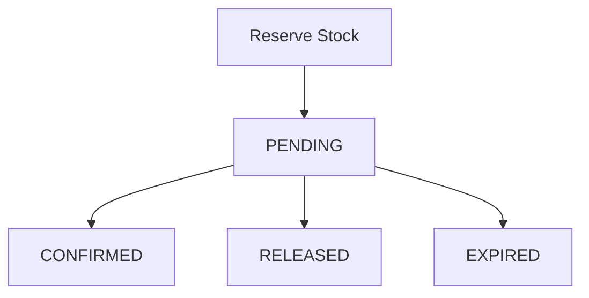

# Allo Reservation System

Inventory reservation platform built using Next.js, Prisma, PostgreSQL and TypeScript.

Live Demo:

https://allo-reservation-system-flax.vercel.app

GitHub Repository:

https://github.com/Harsha-18-H/allo-reservation-system

---

## Tech Stack

- Next.js App Router
- TypeScript
- Prisma ORM
- PostgreSQL (Supabase)
- TailwindCSS
- Vercel Deployment

---

## Features

- Multi-warehouse inventory management
- Temporary inventory reservation system
- Concurrency-safe reservation handling
- Reservation confirmation flow
- Reservation cancellation flow
- Automatic reservation expiry
- Countdown timer during checkout
- Inventory updates without page refresh
- Production deployment using hosted PostgreSQL

---

## Reservation Lifecycle



Status meaning:

- PENDING → reservation created and stock temporarily held
- CONFIRMED → checkout completed successfully
- RELEASED → user cancelled reservation
- EXPIRED → reservation timed out automatically

---

## Database Schema

### Product

| Field | Type |
|-------|------|
| id | UUID |
| name | String |
| description | String |

### Warehouse

| Field | Type |
|-------|------|
| id | UUID |
| name | String |
| location | String |

### Inventory

| Field | Type |
|-------|------|
| productId | UUID |
| warehouseId | UUID |
| totalStock | Integer |
| reservedStock | Integer |

### Reservation

| Field | Type |
|-------|------|
| productId | UUID |
| warehouseId | UUID |
| quantity | Integer |
| status | Enum |
| expiresAt | DateTime |

---

## Reservation Flow

1. User reserves stock
2. Inventory becomes temporarily reserved
3. Reservation remains valid for 10 minutes
4. User confirms purchase → reservation becomes CONFIRMED
5. User cancels → reservation becomes RELEASED
6. Timeout occurs → reservation becomes EXPIRED
7. Inventory automatically becomes available again

---

## API Examples

### Reserve Inventory

POST `/api/reservations`

Request:

```json
{
  "productId": "product-id",
  "warehouseId": "warehouse-id",
  "quantity": 1
}
```

Response:

```json
{
  "id": "reservation-id",
  "expiresAt": "2026-05-24T12:00:00Z"
}
```

---

### Confirm Reservation

POST `/api/reservations/:id/confirm`

---

### Release Reservation

POST `/api/reservations/:id/release`

---

### Expiry Cleanup

GET `/api/cron/expire`

---

## Concurrency Strategy

Reservation endpoint uses:

- PostgreSQL transactions
- Serializable isolation level
- Row-level locking (`FOR UPDATE`)

Why both?

`FOR UPDATE`

- Prevents concurrent writes on inventory rows

Serializable isolation

- Ensures transactions behave as if executed sequentially
- Prevents overselling under concurrent access

Example:

Inventory = 1

Two simultaneous reserve requests:

Request A:

```
Success
```

Request B:

```
HTTP 409
```

Result:

Overselling prevented.

---

## Expiry Mechanism

Reservations store:

```
expiresAt
```

Expired reservations are cleaned through:

```
GET /api/cron/expire
```

Cleanup flow:

1. Find expired reservations
2. Release reserved inventory
3. Mark reservation status as EXPIRED

Production deployment can periodically invoke this endpoint using scheduled jobs.

---

## Local Setup

Install dependencies:

```bash
npm install
```

Environment variables:

```
DATABASE_URL=
```

Run migrations:

```bash
npx prisma migrate deploy
```

Seed database:

```bash
npx prisma db seed
```

Start application:

```bash
npm run dev
```

---

## Tradeoffs

PostgreSQL transactional guarantees were sufficient for single-database consistency requirements.

Redis distributed locking becomes more valuable under horizontally scaled architectures.

Cron-based cleanup was selected for simplicity and operational reliability.

---

## Future Improvements

- Redis distributed locking
- Idempotency keys
- Reservation retry handling
- Metrics and observability
- Load testing
- Rate limiting
- Retry strategies
- Better UI feedback

---

## Deployment

Live URL:

https://allo-reservation-system-flax.vercel.app

GitHub Repository:

https://github.com/Harsha-18-H/allo-reservation-system